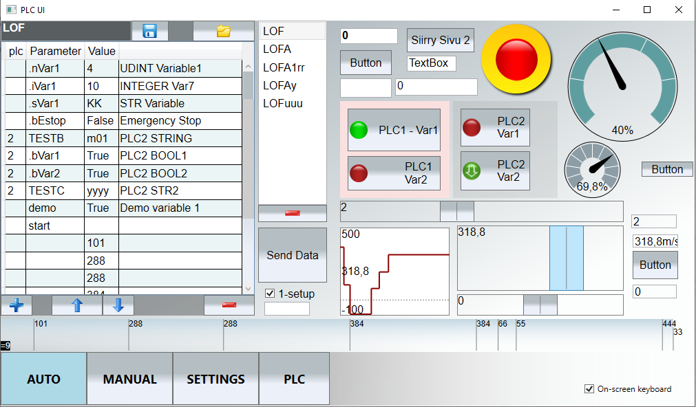
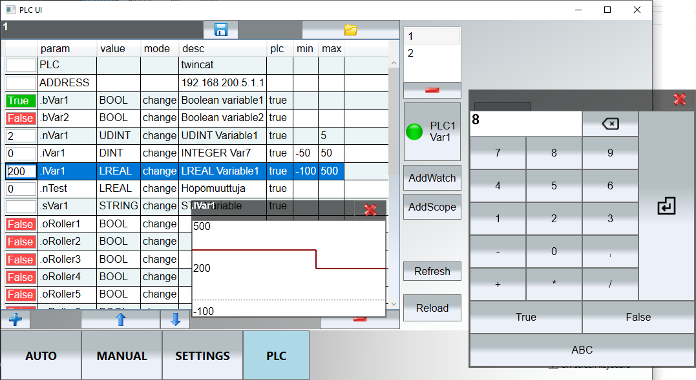

# plcui

Windows based user interface library for plc devices. Currently only supports Beckhoff Twincat but can be further developed to support other devices. Also allows multiple plc devices to be connected to the same user interface. Allows parameterization of the auto program with different settings.
The PLC user interface can be created using Visual Studio using this library. Implemented with WPF.
 
<strong>Elements</strong>
<ul>
<li>Gauge</li>
<li>Oscilloscope</li>
<li>Button</li>
<li>Slider</li>
</ul>

<strong>Keywords</strong> : PLC, Beckhoff, Twincat, UI, HMI.